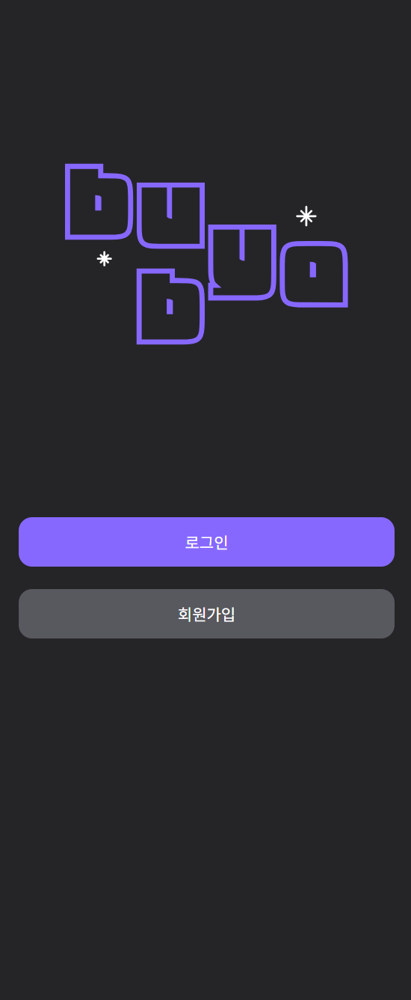
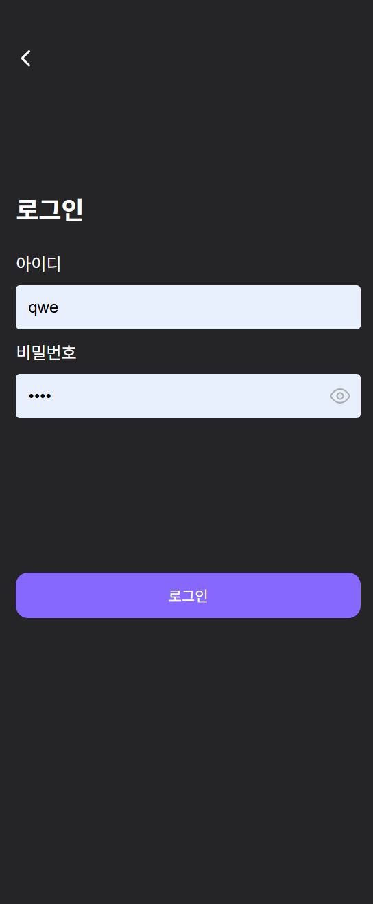
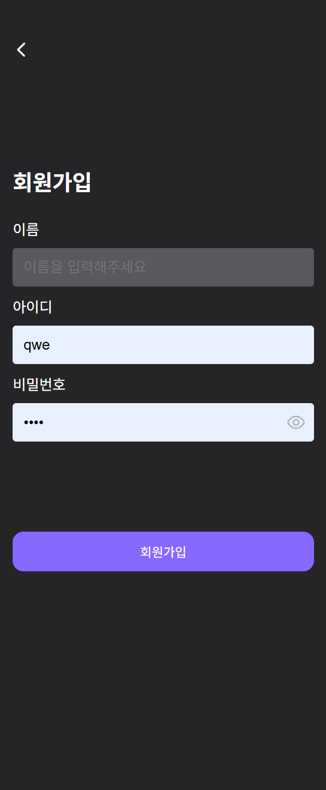
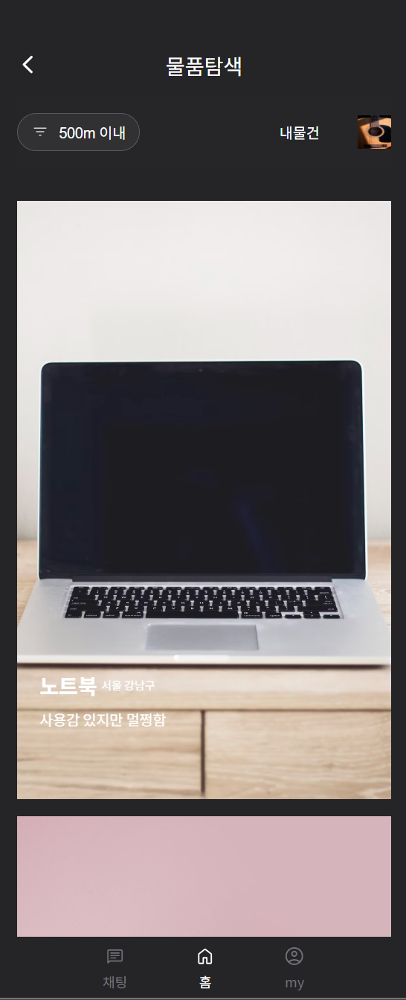
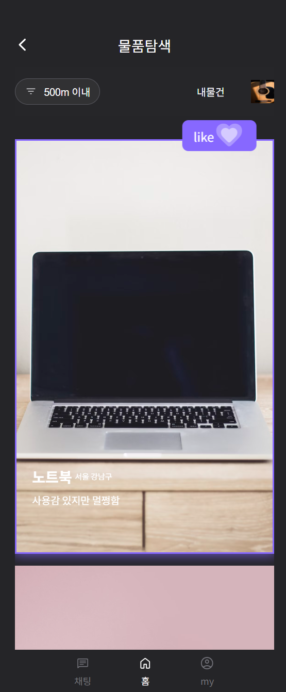
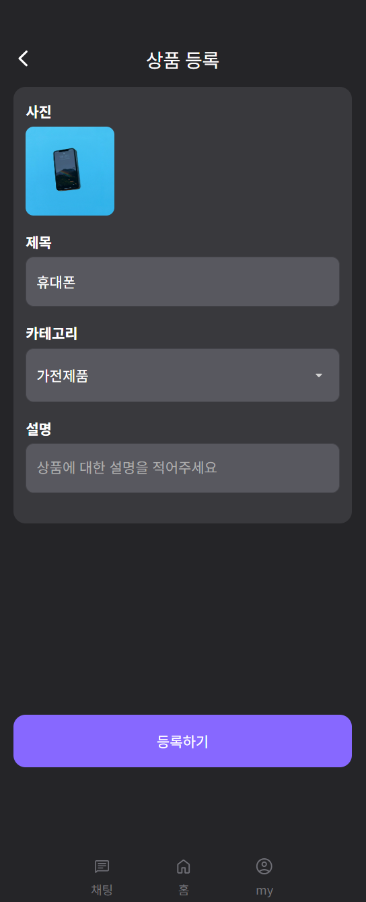
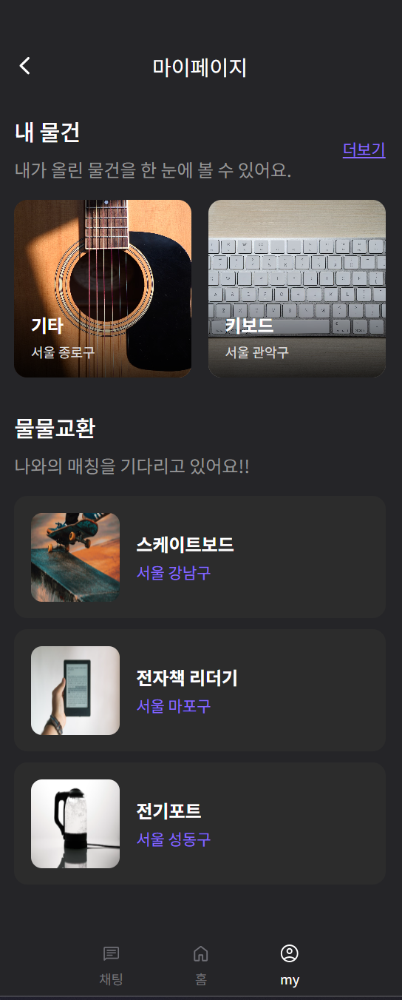
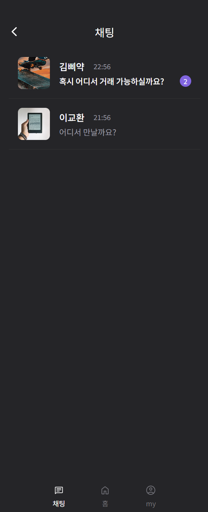
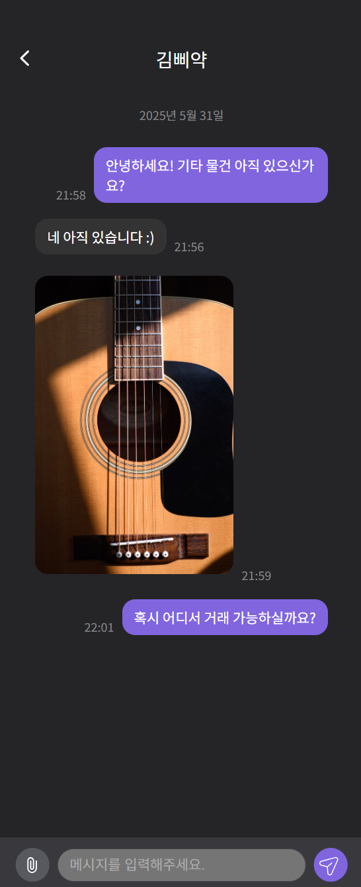
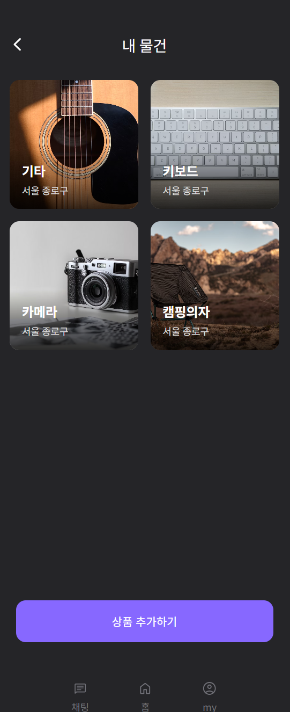

# BYEBUY

사회초년생을 위한 물물교환 기반의 위치기반 매칭 서비스

> 본 레포지토리는 해커톤 프로젝트의 주요 기능을 별도 구성하여 **개인적으로 프론트엔드 가상 데이터 기반으로 재현한 데모 구현**입니다.

## 해커톤 개요

- **행사명**: DevFest 2024 : 삐약톤 캠퍼스 대항전
- **주최**: GDG Campus Korea
- **장소**: 동국대학교 서울캠퍼스, 중구 서애로3길 25, 서울, 04623
- **일시**: 2025년 1월 11일 오전 10:00 ~ 2025년 1월 12일 오후 2:00 (무박 2일)
- **참여 구성**: 프론트엔드 3인, 백엔드 2인, 디자이너 2인

## 프로젝트 소개

**BYEBUY**는 사회초년생(신입사원, 갓 졸업한 대학생 등)을 위한  
**가성비 높은 소비 대안**으로서 **위치 기반 물물교환**을 제공합니다.  
돈 없이도 서로 필요한 물건을 교환하며 실용적인 소비문화를 경험할 수 있도록 도와줍니다.

## 개인 기여

- 앱 시작 화면, 로그인/회원가입 (토큰 기반) 화면 UI 및 흐름 구성
- 물품 탐색(스크롤 기반) UI 및 흐름 구성

## 기능 명세

### 1. 앱 시작화면 및 사용자 관리 (직접 구현)

- 앱 시작화면
- 아이디, 이름, 4자리 비밀번호만으로 간단 로그인

  
  
  

---

### 2. 물품 탐색 (직접 구현)

- 스크롤 기반 탐색 (클릭: 관심)

  
  

---

### 3. 물품 등록

- 제목, 설명, 카테고리, 상태, 사진 1장 포함

  

---

### 4. 매칭 시스템

- 상호 관심 기반 자동 매칭
- 매칭 시 알림 UX 표시

  

---

### 5. 채팅 기능

- 실시간 텍스트 및 이미지 전송
- 채팅방 리스트 및 읽지 않은 메시지 수 표시

  
  

---

### 6. 마이페이지

- 내 프로필, 내 물건, 매칭된 항목 조회

  
  

## 기술 스택

- **React (직접 사용)**
- **React Router DOM (직접 사용)**
- **Styled-components (직접 사용)**
- **Axios (직접 사용)**
- **Zustand (직접 사용)**
- browser-image-compression
- react-snowfall

## 회고

정말 힘들었지만 시간 가는 줄 모를 정도로 몰입했던 첫 오프라인 해커톤 경험이었습니다. 무박 2일로 팀 빌딩부터 아이디어 회의, 개발, 시연까지 모든 과정을 겪으며 팀원 분들께 많은 것을 배울 수 있었습니다. 개발 실력은 물론 커뮤니케이션 능력, 배려심 등 실제 협업 개발 프로세스를 미리 경험하며 저 또한 이런 역량을 갖추기 위해 더 노력해야겠다는 생각이 들었습니다. 수상은 하지 못했지만, 이 시기의 해커톤 경험을 통해 개발에 대한 흥미가 다시 샘솟았고, 이 경험을 계기로 이후 개발 역량을 한층 더 성장시킬 수 있었습니다.
